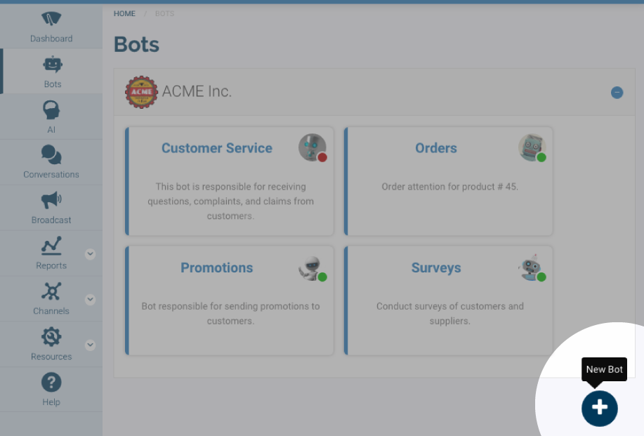
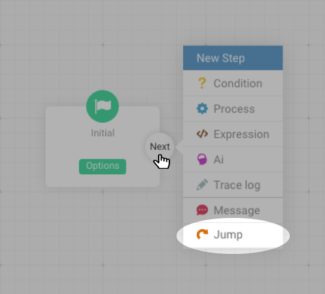
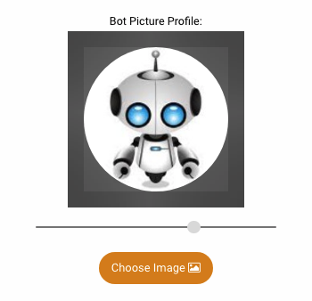
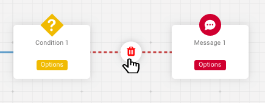

# User Guide

## Technical concepts

WhatABot is a conversational service of automatic response, where technologies of chats \(platforms of conversation\) and Bots \(Systems of automatic responses\) are integrated. It works when in a conversation the end- user sends a message to the Bot and this automatically returns another message as a response by following a set of business rules which are easily defined by simple flow charts.

### Bot Model

Such set of rules is known as Bot model. TheWhatABot website offers a tool called designer where it is possible to build the Bot model step by step.

### Status

The Bot must know the exact point where a conversation is going on in order to generate responses that are coherent to the conversation context. To do so, the Bot uses a status machine that determines such context.

There is an initial status for new conversations and as many status are needed can be defined depending on the topics the Bot will be able to respond. Every time the Bot responds it is possible to do, or not, a transition to a different status in the conversation itself.

### Bot variables

To get the Bot can more accurately determine the context of the conversation, besides the status, a series of variables can be defined. During the conversation those variables are getting enriched. It is possible to define as many variables as necessary depending on the rules and scope given to the Bot.

### Conversation Variables

They are defined within an object called **chat** that contains them and as mentioned above, these variables are filled during the conversation.

The scope of these variables is defined by each conversation and the duration of the dialogue \(timeout\).

### Message variables

They are defined within an object called msg and represent the message sent by the end user to the Bot:

| variable | Description |
| :--- | :--- |
| `msg.body` | This variable shows the text of the message sent by the user. |
| `msg.type` | This variable shows the type of message sent by the user. |
|  | `chat` if it is a text message. |
|  | `image`if the sent message is an image or a picture. |
|  | `document`If the message  is a PDF, Word, Excel or Powerpoint document. |
|  | `location`If the message is a GPS location. |
|  | `audio`If the sent message is an audio. |
|  | `video`If the sent message is a video. |
|  | In case the message type sent is different from chat, in the `msg.body` variable you can get the content of the multimedia element in DataUrl format. |
| `msg.id` | This variable displays the user identifier that sends the message. |
|  | For WhatsApp, the identifier is the country code + the phone number + @c.us. |
| `msg.profile` | This variable displays the name of the user who sends the message. |
|  | In the case of WhatsApp, most of the time this field will appear blank as users when installing WhatsApp do not supply it. |
| `msg.email` | This variable shows the email address of the user that sends the message. |
|  | Not available on WhatsApp |
| `msg.line` | This variable displays the WhatsApp line identifier or Facebook page by which the Bot interacts with the end user who sends the message. |
| `msg.platform` | This variable shows the type of messaging platform used by the Bot. Whats App - Facebook Messenger - Web Chat |

> The message variables are brief and have only scope while the Bot determines the response to be returned to the end user.

### Designer

The Bot model is defined in the designer by simple flow diagrams, which are composed of Steps and Connectors.


Each diagram starts with a ‘Status’ step \(represented in green\) and via Connectors links to other Intermediate Steps until you reach a Final Step of ‘Message’ \(represented in red\).

As many diagrams as states will have the conversation are defined. The designer draws a lane for each.

### Types of steps

**Status step**

This step represents the conversation status. It is the initial step that the Bot must follow to generate the response to the end user depending on the state of the conversation.


**Condition step** 

Through this step the Bot evaluates a condition to determine which path to continue in flow.


**Process Step**

Through this step the Bot can be connected to external systems \(ERP, CRM, etc\) and obtain or send information by using webhooks.


**Expression Step**

Through this step the Bot can make simple calculations using mathematical, numerical, text and/or date-time formulas.


 **Tracing step**

Through this step the Bot can make a record of the conversation activity. It is useful for creating reports and statistics on the use of the Bot.


 **Step Message** 

Through this step the Bot finishes the flow and gets the final answer to be returned to the end user. In this step it is possible to change the conversation status as necessary.


### Webhook

For the Bot to connect to external systems, it is necessary in the Process Step to specify a Webhook url which must be developed in the programming language of your choice and must meet the following specifications:

* The Web Service must be type RESTful with JSON format. 
* Methods allowed GET and POST. 
* The service must respond with a chat object that includes the variables defined in the Bot and Process Step:


* All Bot variables are type "text". 
* If the method is POST, you can send part of the `chat` objects and `msg` that are marked in the Process Step


## Bots

In this section you will find everything you need to create, edit and delete bots.

### Available Bots

To view the available bots, click the "bots" button on the side menu, to be directed to the bots section.

In this section, available bots appear on cards, grouped into drop down containers, separated by customer.


Each card shows the name, image, status and description of a bo


### Open bot

Identify the bot to open and position the cursor on it.


Two buttons appear on the card: "Open" \(in blue\), opens the bot in the designer; "Delete" \(in red\) offers the option to remove the bot.

Click "Open" The bot will open in the designer to be viewed or edited.


`watch video`

### Designer Interface


The designer interface is the space where you can create and edit the models. It is composed of 4 parts:


1. Image \(with status\), name and client of the bot.

2. Toolbar of the bot. The toolbar offers the following options:

| Tool | Icon | Function |
| :--- | :--- | :--- |
| Zoom in |  | Increases the size of the model |
| Zoom out |  | Decreases the size of the model |
| Select/Hand |  | Select: selection mode./Hand: allows to move the workspace. |
| Create status |  | Creates a new status in the model |
| Save bot |  | Saves changes made in the bot |
| Bot options |  | Opens the options menu for the bot |

3. Initial Status.

4. Work space

### **Creation of a bot**

In the "Bots" section at the bottom right, a button with the icon \(+\) appears. Click on it.



The designer where you can start building the bot will be opened.


### Create status step 


Identified with green color and icon \( \). Status step is used to create different states in a conversation.Inia

To create a status step, go to the toolbar, then click the "Create Status" button, identified with the icon \( \).


The new status step, will appear at the bottom which divides the workspace with a dark blue horizontal line \(rail\).


#### Properties of the  Status step.

To open the properties of a state step, click the "Options" button on it, a _modal_ like the following will appear: 


A Status step has two properties: 

1. **Name:** Enter the name that will have the status step. 

2. **Next step:** next step in the flow of the model.

### Create Condition step 


Identified with the color yellow and the icon \( \). The step evaluates a condition, if true, the flow of the conversation will take the "Yes" path; otherwise, the flow of the conversation will take the "No" path. Position yourself on any intermediate step, click the "Next" button, "Yes"/"No" \(in condition\), a context menu will appear with the available steps. 


Click on "Condition", then the condition step connected with the previous step will appear.

#### Properties of Step Condition

To open the properties of a condition step, click on the "Options" button , a _modal_ like the following will appear: 


A condition step has 4 properties: 

1. Name: enter the name that will have the step condition. 

2. Condition: condition to evaluate. You have the following options:

* The variable to evaluate \(`a`\). 
* Comparison operator, you can choose any of the following options:

| Operator | Kind | Description |
| :--- | :--- | :--- |
| **Equal to** | Text / Numeric | If the variable `a`is equal to the value `b`. |
| **Start with** | Text | If the content of the variable `a`starts with or is equal to the value `b`. |
| **Do not start with** | Text | If the content of the variable `a`does not start with the value `b`. |
| **Contain** | Text | If anywhere in the content of the variable `a`is the value of `b`. |
| **Do not have** | Text | If the value of `b`is not contained in any part of the variable `a`. |
| **Empty** | Text | If the variable `a`has no content. |
| **Not empty** | Text | If the variable `a`contains at least one character. |
| **Greater than** | Text / Numeric | If the value of the variable `a`is greater than the value of `b`. |
| **Greater than or equal** | Text / Numeric | If the value of the variable `a`is greater than or equal to the value of `b`. |
| **Less than** | Text / Numeric | If the value of the variable `a`is less than the value of `b`. |
| **Less than or equal to** | Text / Numeric | If the value of the variable `a`is less than or equal to the value of `b`. |
| **Regex** | Text | If the value of the variable `a`complies with the regular expression given in `b`. |

* The value \( `b`\) against which it will be compared `a`.
  1. **Yes** : next step in the flow of the model in case condition is fulfilled.
  2. **No** : next step in the flow of the model in case condition is **not** fulfilled.

     `watch video`

### Create Process step 


Identified with the blue color and the icon \( \). The process step is used to connect to third party systems \(by using Webhooks\) and obtain or send information. Position yourself on any intermediate step, click the "Next" button, "Yes"/"No" \(in condition\), a context menu will appear with the available steps. 


Click on "Process", then the process step connected with the previous step will appear.

#### Properties of a process step.

To open the properties of a process step, click on the options button of the process, a modal will appear as follows: 


The Process step has 3 properties:

1. **Name** : Enter the name that will have the process step.
2. **Webhook** : method, url and  necessary variables for the webhook operation:

Method: you can choose between GET or POST to make the request.

Variables: you can send and receive variables as follows:

* Webhook variables: \(GET/POST\) define the variables that the Webhook will return.
* POST variables: \(POST\) select the variables you are sending to the Webhook. 


3.**Next step:** next step in the flow of the model. `watch video`

### Create Expression step 

 


Identified with the brown color and the icon \(&lt;/&gt;\). This step allows to evaluate an expression \(or formula\) and store the result in a variable \(new or existing\) of the conversation for later use. Position yourself on any intermediate step, click the "Next" button, "Yes"/"No" \(in condition\), a context menu will appear with the available steps. 


Click on "Expression", then the expression step connected to the previous step will appear.

#### Properties of step expression.

To open the properties of an expression step, click the "Options" button on the expression step, a modal like the following will appear:


A expression step has four properties: 

1. **Name:** enter the name that will have the expression step.

2. **Variable bot:** the variable where the result of evaluating the expression will be saved, note that you can create it \(by writing the name\) or use an existing variable \(selecting it from the drop-down field\).

Remember that it is a conversation variable `chat.`as seen at the beginning of the field.

3. **Expression:** Enter in this field the expression you want to evaluate, note that literal values as text \(strings\) must be enclosed in quotes:

`"Good morning"`, integer values are entered without quotation marks: `12`if you use decimal point should go to: `12.56`.

It can also include variables \(of conversation or message\) that must go between symbols "greater than" and "less than": `<msg.body>`, `<chat.myVariable>`. 

In the expression you can do arithmetic operations: `3 + 6`and use functions. An expression has the following options:


1. **Insert variable:** you can insert an existing variable. 

2. **Functions:** The available functions are:

| Kind | Function / Operator | Description |
| :--- | :--- | :--- |
| Arithmetic | **+** | **Add** : add 2 numeric values `3 + 8`returns 11 |
|  |  | **Concatenate** : concatenate text values `"Good" + " " + "morning"`return "Good morning" |
|  |  | **Add days** : add days to a date `Now + 1`return the date of tomorrow. |
|  | **-** | **Subtract** : subtracts 2 numeric values `8 - 4`returns 4. |
|  |  | **Subtract days** : subtracts days to a date `Now - 1`returns yesterday's date. |
|  |  | **Subtract dates** : subtract one date from another `Date("2018-04-25") - Date("2018-04-23")`returns 2. |
|  |   **\***   | **Multiply** : multiply 2 numeric values `3 * 8`returns 24. |
|  | **/** | **Divide** : divide 2 numeric values `27 / 9`returns 3. |
|  | **%** | **Module** : obtains the remainder of the division of 2 numerical values `14 % 3`returns 2. |
|  | **^** | **Power** : get the power of a number `3 ^ 3`returns 27. |
| Numerical | **Val \(txt\)** | Converts a text value to numeric `Val("54")`returns 54. |
|  | **IsNumeric \(txt\)** | Determines \(true / false\) if a value is numeric `IsNumeric(735)`returns "true". |
|  | **Abs \(num\)** | Returns the absolute value of the numeric value, `Abs(-3)`returns 3. |
|  | **Floor \(num\)** | Returns the resulting integer by rounding down the given numeric value,`Floor(7.85)`returns 7. |
|  | **Ceiling \(num\)** | Returns the resulting integer when rounding up the given numeric value,`Ceiling(7.25)`returns 8. |
|  | **Min \(num, num\)** | Returns the smallest value between the two given numbers, `Min(9, 4)`returns 4. |
|  | **Max \(num, num\)** | Returns the highest value between the two given numbers, `Max(7, 3)`returns 7. |
| Text | **Len \(txt\)** | Returns the length of the text string `Len("Texto")`returns 5. |
|  | **Str \(txt, \[format\]\)** | Returns the numeric value or date as a text string according to the [format](https://chat-bots.co/es/docs/bots#) \(optional\) |
|  | **LowerCase \(txt\)** | Returns text string converted to lowercase `LowerCase("TEXTO")`returns "text" |
|  | **UpperCase \(txt\)** | Returns text string converted to upper case `UpperCase("texto")`returns "TEXT". |
|  | **TrimLeft \(txt\)** | Returns the text string by removing the blank spaces on the left,`TrimLeft(" texto")`returning "text". |
|  | **TrimRight \(txt\)** | Returns the text string by removing the blanks on the right,`TrimRight("texto ")`returning "text". |
|  | **Left \(txt, num\)** | Returns the specified number of characters at the beginning of the text string `Left("Hello world", 4)`returns "Hello". |
|  | **Right \(txt, num\)** | Returns the specified number of characters at the end of the text string `Right("Hello world", 5)`returns "world". |
|  | **Mid \(txt, pos, lng\)** | Returns the characters from the center of the text string, according to position and length`Mid("Hello world", 3, 3)`returns "the". |
|  | **InStr \(txt, search\_txt\)** | Returns the position of the text to be searched within the given text string `InStr("Hello world", "the")`returns 3. |
|  | **Replace \(txt, search\_txt, new\_txt\)** | Returns the text string replacing the text to search for the new text `Replace("Hello world", "world", "planet")`returns "Hello planet." |
| Date | **Date \(txt\)** | Converts a text value to date / time `Date("1995/09/18 19:32:24")`returns \# 1995-09-18 \#. |
|  | **IsDate \(txt\)** | Determines whether a text value can be converted to date / time `IsDate("1995/09/18 19:32:24")`returns True. |
|  | **Day \(date\)** | Returns the day of the given date `Day("1995/09/18 19:32:24")`returns 18. |
|  | **Month \(date\)** | Returns the month of the given date `Month("1995/09/18 19:32:24")`returns 9. |
|  | **Year \(date\)** | Returns the year of the given date `Year("1995/09/18 19:32:24")`returns 1995. |
|  | **Hour \(date\)** | Returns the time \(0 - 23\) of the given date / time `Hour("1995/09/18 19:32:24")`returns 19. |
|  | **Minute \(date\)** | Returns the minute \(0 - 59\) of the given date / time `Minute("1995/09/18 19:32:24")`returns 32. |
|  | **Second \(date\)** | Returns the second \(0 - 59\) of the given date / time `Second("1995/09/18 19:32:24")`returns 24. |
| Logic | **And** | Given 2 values ​​of Boolean type, it returns True if both values ​​are evaluated as True, otherwise it returns False, `True And True`returns True. |
|  | **Or** | Given 2 values ​​of Boolean type, it returns True if any of the values ​​is evaluated as True.`True Or False`returns True. |
|  | **Xor** | Given 2 values ​​of Boolean type, it returns True if only one of the values ​​is evaluated as True.`True Xor True`returns False. |
|  | **Not** | Converts a value of Boolean type to its opposite `Not False`True- returns |
|  | **Iif** | Check if a condition is met and return "yes value" if true or "no value" otherwise`iif(<chat.miVariable> = "hola", "valorSi", "ValorNo")` |
| Constants | **True** | True Counter \(true\) |
|  | **False** | Constant False \(false\) |
|  | **Now** | Current date and time of the system. |
| Operators | **=** | **equals**: check if two values ​​of the same type are equal `3 = 3`returns True. |
|  | **&gt;** | **Greater than** : checks if the first of 2 values ​​of the same type is greater than the second one`3 < 3`returns False. |
|  | **&gt; =** | **Greater than or equal to** : checks if the first of 2 values ​​of the same type is greater than or equal to the second `3 >= 3`returns True. |
|  | **&lt;** | **Less than** : checks if the first of 2 values ​​of the same type is less than the second one `3 < 3`returns False. |
|  | **&lt;=** | **Less than or equal to** : checks if the first of 2 values ​​of the same type is less than or equal to the second `3 <= 3`returns True. |
|  | &lt;&gt; | **Different** : check if 2 values ​​of the same type are different `3 <> 3`returns False. |

3. In the literal text values \(Strings\)  between quotes you can insert emojis.


4. **Next step:** next step in the flow of the model. `watch video`

### Create Tracing step 


Identified with the gray color and the icon \( \). This step allows to generate a trace with up to 3 dimensions that is recorded in the system each time the conversation passes through it. It is useful for creating reports and statistics on the use of the Bot.

Position yourself on any intermediate step, click the "Next button, "Yes"/"No" \(in condition\), a context menu will appear with the available steps. 


Click on "Trace", then the trace step connected to the previous step will appear.

#### Properties of the tracing step.

To open the properties of a trace step, click on the "Options" button, a modal like the following will appear:


A trace step has 4 properties: 

1. **Name:** enter the name that will have the trace step. **Remember that with this name the traceability reports will be generated.** 

2.  **Dimensions:** you can save up to 3 different values. You can include variables.

> Remember that the trace includes 3 default dimensions that are date/time, line and contact. 
>
> 3. **Annotation:** you can generate a note to your liking or need, this note can contain the amount of variables you need. 
>
> 4. **Next step:** next step in the flow of the model. `watch video`

### Create Message step 


Identified with the color red and the icon \( \).

The message step is used to send a message to the user interacting with the bot, capture the answer in a variable and jump to a status.

This step just as jump, is the last of a flow within a status, therefore, does not allow descending steps.

Position yourself on any intermediate step , click on the "Next" button, "Yes" / "No" \(in condition\), a contextual menu with the available steps will appear.


Click on "Message", the message step connected to the previous step will appear.

#### Properties of the message step.

To open the properties of a message step, click on the "Options", a modal like the following will appear:


The message step has 3 properties: 

1.**Name:** enter the name that will have the message step. 

2. **Message**

* SENDING A MESSAGE
  * **Send message:**  compose in this field the message you want to send to the user, remember that this text can include variables, emojis and multimedia content; to insert them you can use the options \(buttons\) that are on the right side of the field.

    \*\*\*\*

  * **Quick answers:** Quick answers allow you to insert buttons \(not applicable in WhastApp\) selectable by the user with a number of options to choose from. If you want the button to have a label \(text\) different from its value, separate the value of the label with a pipeline \(\|\); in this way `size S | a`, it would present a button with the label "Size S" but when selecting it the returned value would be "a". If you only use the label, that will be the value of the button when selected: it `size S`presents a button with the label "size S" and returns the value "size S" when selected.

> Separate each "quick response" with a comma \(,\) or press the key `ENTER`.
>
> * OPTIONS
>   * **Save user response in:** if the user responds to the message sent, you can save that answer in a new variable or an existing one. Remember that it is a `chat.` conversation variable,  as seen at the beginning of the field.
>   * **Download multimedia content of the response:** if the user's response is multimedia content \(audio, image, video or document\), you can store said content in DAtaURI in the previously defined variable.
>   * **Mask user response:** prevents the storage of the response in the Chat-Bots databases.
>
>     Take into account that if you mask an answer, you will not have access to it later to generate reports or queries.

1. **Change bot to status:** You can pass the conversation to another state or continue in the current state. After you define the next state, you will notice a mark in the step that tells you which state will follow the flow of the conversation.


### Create jump step 


Identified with the orange color and the icon \( \). The jump step is used to pass the conversation to another bot. This step as well as message step, is the last of a flow within a state, therefore, does not allow descending steps. Position yourself on any intermediate step, click the "Next" button, "Yes"/"No" \(in condition\), a context menu will appear with the available steps. 



Click on "Jump", then the jump step connected to the previous step will appear.

#### Jump step properties

To open the properties of a jump step, click the "Options" button on it, a modal like the following will appear:


The jump step has 2 properties: 

1. **Name:** type the name that will have the jump step. 

2. **Go to bot:** bot to which you are going to pass the conversation, this property is divided into 2 fields:

* **Customer:** select the client where the bot you are going to use is located. 
* **Bot:** select the bot to which the conversation is going to go.

> A mark on the step will indicate which bot will continue the conversation.


> The conversation variables persist in the bot to which you made the jump.

`watch video`

### Save bot

To save a new bot, click on the image, name, status and customer area, as shown in the image. 


A modal will appear as follows: 


In this modal you will find 4 options:

1. **Name of the bot:** enter a name for the bot.

2. **Customer:** select a customer for the bot.

3. **Description:** type a description for the bot.

4. **Bot image:** \(optional\) you can assign an image to the bot.

* To do this, click the "Choose Image" button:


A file manager will appear \(varies depending on the operating system\), select the image you want to upload.

* The image will be loaded into the box \(as shown below\), you can move it with the cursor to place it in the desired position, you can also make it bigger \(to the right\) or smaller \(to the left\) by moving the slider which is at the bottom.



* After entering all parameters correctly, click the "Save" button, a notification will appear at the bottom right indicating that the bot has been successfully saved.


> If you need to modify any of the parameters described above, repeat the process.

To save later modifications to the structure or data of the bot, click the "Save" button. 


`watch video`

### Delete bot

To delete a bot you must go to the "Bots" section and identify the card of the bot that you are going to delete. 


Then move the cursor to the card, the "Delete" button will appear, click it.


A confirmation mode will appear, click the "Delete" button to delete the bot or click "Cancel" to abandon the operation.


### Bot options

Each bot has a panel with multiple options, to access it you must go to the toolbar "Options" button, then click on it. 


A panel with the available options will appear.


To hide the options pane, move the cursor to the toolbar and click the "Close" button \(same as you used to open the panel, but in this case with the icon \( \) and a slightly darker background\).


#### Tools

Below is the list of tools you have available when working with a bot.

**Validate bot**

This option allows to check if the current model is valid. Among the validations are:

* Continuity between the steps.
* Orphaned steps.
* Configuration of the parameters of each step.

This option only validates the structure of the bot, not its overall performance. To validate a bot, click Options&gt;Validate. If you have a validation error, the program will indicate it with a notification at the bottom right \(2\); it will also mark the specific step where the error is \(1\). 


When the bot has passed the validation successfully, a notification will appear at the bottom right indicating that the model was validated correctly. 


`watch video`

**Select all**

This option allows you to select all the steps of a bot to move them at the same time. To select all steps, click Options&gt;Select all, you will notice that all steps are selected \(marked with a semitransparent border\), then you can position the cursor on any step and drag. All steps will move at the same time. 


To remove the selection, simply click on any empty part of the workspace. `ver video`

**Dialogue Timeout**

All conversations in which a bot interacts have an expiration period, this is known as "dialogue timeout", and refers to the maximum time a user can restart a conversation. After the inactivity period, the conversation will return to the initial status and all the conversation variables will be reset.

To modifyl the default time \(20 minutes\), click on Options&gt;_timeout of the dialog_, a modal with three fields will appear: Days, Hours, Minutes.


> Minimum time is 5 minutes and maximum time is 365 days.
>
> **Show texts**
>
> When the structure of a model has increased quite, it may be useful to see all texts sent to the user by means of the message steps, instead of having to access the properties of each step to see them. To display all the texts of the message steps, click _Options&gt;View texts_. Next to each message will appear a blue box with its respective text.


To hide texts, click _Options&gt;View texts_,each time you show or hide the texts, an icon \(next to the option\) will indicate if they are active \( \) or inactive \( \).

**Create copy**

When you need to work on a bot without altering its original structure or creating a new bot from an existing one, the platform offers you the option to create a copy of the bot, to do so follow these instructions: 

1. Go to the bots section.

2. Locate the bot you are going to copy.

3. Click "Open". \(see existing bots\).

4. Then click _Options&gt;Create copy._ 

5. A modal with the information of the bot you are copying \(similar to the save bot\) will appear. 


6. Modify the data and image of the bot to your liking \(it is mandatory to change the name unless you choose to assign the bot to another customer\), when you have finished, click "Save" 

7. A notification will appear at the bottom right, indicating that the operation was successful.

> The bot you just copied will be automatically loaded into the designer. `watch video`
>
> **Exporting**
>
> You can export any bot to an external file \(.bot\) to later upload it to the platform. To do so, open the export bot \(if you don’t know how, see available bots\), click _Options&gt;Export._ The file will automatically be saved in the "Downloads" folder or it will ask for a path to be stored \(depending on your browser settings\).


 `watch video`

**Importing**

In order to import a bot you must: 

1. Go to the bots section.

2. Click on the "Create bot" button, identified with the icon \( + \) or open a bot you want to overwrite.

3. In the "Designer" section, click _Options&gt;Import_.

4. A file manager will appear \(varies depending on the operating system\), to choose the file with the desired bot. Select it and click "Open".

5. The bot will be loaded into the designer keeping all the settings you had at the time of exporting.

6. Save the changes. `watch video`

**Web chat**

Chat-Bots allows you to create a bot that can be used to answer your customers' requests directly on your website. To generate a Web Chat click _Options&gt;Web chat._ A modal like this will appear:


1. Click the "Enable Web Chat for this Bot" box.

2. Enter a welcome text for your Web Chat.

3. Click the \( \) button to copy the code to the clipboard.

4. Click "OK". The code you copied to the clipboard must be sent to the website programmer for insertion before the tag `</body` closes on the website. Then, on the web page, on the bottom right the Web Chat window will appear, you can open or close it by clicking on the blue bar.


#### Try Bot

The WhatABot platform has a tool that allows you to test the bot you are developing, to use it go to _Options&gt; TRY BOT_ 


Enter your messages in the "Message" field and click the "Send" button or press `enter` to send the message. At the top the messages and responses of the bot will show.

 

Notice also that this tool allows you to see the _status_ and current value of the variables as you try the bot; to do this, click the blue button with the icon \( \)

 

A window with the current status , the variables defined in the conversation and the value they contain will appear.

 `watch video`

#### Try Whatsapp

To test your WhatsApp bot, go to _Options&gt;TEST WHATSAPP._ If your bot has an assigned line, you can test directly on it, otherwise you can register up 3 cell phone numbers to test through a line provided by Chat-Bots for this purpose. 


Choose a country from the dropdown list, then enter the cell phone number you want to register and click the "Register" button. 


A table with the number of the line you can test, the cell number registered, the validity and the option to delete the registered number will appear. If you want to register another number, repeat the previous step. 


When you have finished registering the cell phone numbers, click the "Go to WhatsApp" button. The WhatsApp application \(on the mobile\) or WhatsApp Web \(in the browser\) will open.


> Remember that you can only do tests with the cell numbers you registered for 24 hours
>
> ### Various
>
> Below you can find several concepts that will be useful when working with bots.
>
> #### Connectors
>
> Each step of the bot model is joined to another by means of a connector.
>
> The designer has 2 types of connectors: 
>
> 1. **Default connector \(YES, in condition\):** blue, with arrow point in the center indicating the direction of the flow.


2. **Exception connector \(NO in condition\)**: red, with arrow point in the center indicating the direction of the flow.


To delete a connector you have 2 options:

1. Take the cursor to the center of the connector, a button with the icon \( \) will appear, click it and the connector will disappear. 



2. Place the cursor on the first of 2 connected steps \(source step\), click the "Options" button, a modal will appear \(varies depending on the type of step\). In the option "Next step:" \(status, process, expression, trace\), "Yes:"/"No:" \(condition\), the name of the step which you are connected with will appear, click the red button "Disconnect step" with the icon \( \), then click on "OK".


To connect steps you have the following options:

1. Place the cursor on the first of the 2 steps \(source step\) you are going to connect, a button will appear with the text "Next", click and drag to the step you want to connect with \(destination step\), drop the mouse button and the two steps will be connected.  


2. Place the cursor on the first of the two steps you want to connect \(source step\), click on "Options" button, a modal will appear \(it varies depending on the type of step\). In the option "Next Step:" \(status, process, expression, trace\), "Yes:" and "No:" \(condition\), a list of steps which you can join the current step will appear, select the step to connect and click "OK".


#### Move a step

Move any of the steps of the model is very easy. To do so, place the cursor on the step you want to move, the cursor will change its shape indicating that the step allows to be moved. 


Click and drag the step to the desired position, then drop the mouse button and the step will be placed in the new position.

#### Move several steps

If you need to move several steps at a time, click on any empty part of the workspace, drag the cursor until the semitransparent blue rectangle that appears covers all the steps you need to move. 


Release the mouse button and you will notice that the steps are selected \(with a semitransparent border\). Place the cursor over any of them, click and drag to the desired position, you will notice that the selected steps move at the same time.

> If you need to move steps that cannot be selected in the way described above, an alternative form of selection is to hold down the `CTRL` \(Control\) key and without dropping it, click on each step you are going to move. Then you can drop the control key and move the selected steps as it was explained before.


#### Move rail

If you need to move a rail and all the steps it contains, bring the cursor closer to the blue dividing line, you will notice that the cursor changes its shape, indicating that you can move the rail up or down.


#### Insert Variables

In the properties of some steps, you will find fields in which you can insert variables, these fields have a blue button with the icon \( \). To make it easier to enter the variables, click on the button mentioned above, a context menu will appear with the available variables. 


Then click on the variable you want to insert.

#### Delete a step

To delete a step, place the cursor on the step you need to delete. A button with the icon \( \) will appear, click on it.


A confirmation window will appear, click on _delete_ to finish the process.


## Conversations

In this section you can filter the conversations by client, date, bot and line to view in **real time** the incomming chats of each contact. To access the conversations section, click on the "Conversations" button on the left side menu.


### Filter

To filter the conversations you want to view, click _Filter_ \(1\); then click _Date_ field\(2\), a calendar will be displayed, select the deadline, then choose the customer by clicking on the _Customer_ field \(3\). Now mark the bots and the lines you want to filter \(4\). Click on the "View conversations" button.


The conversations that met the filter criteria will be displayed in the _Conversations_ tab \(1\), you can see the amount of chats for the chosen date\(2\) , if there are new messages in a chat you will be informed with an identifier \(3\), select any conversation by clicking on it\(4\) , date of conversation\(5\), chat messages \(6\), to return to the last messages of the selected chat click the _download_ button \(7\).


### Filter search

**Lorem ipsum dolor, sit amet consectetur adipisicing elit. Numquam deleniti quisquam aperiam sunt voluptas inventore dignissimos ipsum. Eius error maiores illo discomfort sunt eligendi iste dolore, earum pain assumenda unde.????\(Esto es lo que aparece en el documento original\)**

### Complement conversation

At any time an agent \( registered user on the platform\) can complement a conversation by taking \(provisionally\) the bot place and answer a user´s requests. To complement any conversation execute first the _filter process_, then write the answer message in the _send message_ field and click _send_ or press `Enter`key.


Notice that when complementing a conversation, the platform automatically adds the name of the agent so the final user knows that someone is providing support.


> In order to complement a conversation, a user must have permission from the agent.

## Broadcast

In this section you can program messages which will be sent massively to your clients or prospects. In order to access the Broadcasting section, click _Broadcast_ on the left side menu.


### Create broadcast

In this section you can program messages which will be sent massively to your customers or prospects. To create a broadcast click on _Create broadcast._


To surf between the broadcast steps click on circular buttons \(1, 2 , 3 and 4\).


You can also use _previous_ and _next_ buttons to move forward or go back between steps.


#### 1: Name and line

Enter a name for broadcasting \(1\), select a costumer from the dropdown list \(2\) and select a line for dissemination \(3\).


Click on the "Next" button or on the circular button with number 2 at the top to go to the next step.

#### 2: Import recipients

Click the "Import Recipients" button \(1\) and select the file \(.txt or .xlsx\) that contains the recipients to load. The system will tell you how many numbers were loaded \(2\). You can also download the list of imported recipients by clicking the "Download" button \(3\). \(3\).


> Only the numbers that have interacted with the selected line in step 1 will be filtered.
>
> If the chosen file is in excel \(.xlsx\) format, the recipients must appear in the first column \(A\) of the first spreadsheet of the book so that the system can read them.

Click the "Next" button or the circular button with number 3 at the top to move on to the next step.

#### 3: Write a message

Write the message you are going to send in the text box that appears_._


You can divide your message in different bubbles by adding more text boxes_._


Each text box has the following options: 

1. **Emojis and multimedia content:**

* Click icon \(  \) to insert an emoji in the message.
* Click icon \(  \) to insert a multimedia content \(audio, video, file\).

_2._ **Delete text box:**  Delete text box and its content.

Click the "Next" button or the circular button with number 4 at the top to move on to the next step.

#### 4: Send or schedule

To send the broadcast, click on \*Send now".


You can also schedule the sending of the broadcast by checking the "Submit Later" box.


Select date and time by using the calendar that appears and click on _program_ button \(2\).


### See broadcasts

All created broadcasts in previous steps can be viewed, edited, and deleted from the "SEE BROADCASTS" section.

### Previously created broadcasts

To view previously created broadcasts click on the "SEE BROADCASTS" tab.


A table with all the created broadcasts so far will appear .


In the table you will find the following options:

* **Name:** name given to the broadcast.
* **Line:** number of lines from which the broadcast is sent.
* **Recipients:** number of recipients + button to download the list in a plain text file \(.txt\).
* **Created:** date when the broadcast was created.
* **Created by:** name of the user who created the broadcast \(taken from the system\).
* **Scheduled:** date and time when sending the broadcast is scheduled
* **Sent:** date and time the broadcast is sent.
* **Status:** the broadcast can be in any of these 3 states:

  \(icon here\) - The broadcast has been scheduled and will begin to be sent on the date and time indicated.

  \(\)  -   The broadcast is currently being sent.

  \(\)  -   The broadcast has been sent to all recipients.

  \(\)  -   The broadcast has been canceled.

* **Actions:** edit or delete the broadcast.

  \*\*\*\*

## **Reports**

The reports section allows you to generate reports about the bot use. This section has 2 options: Traces and Indicators. To access the Reports section, click the "Reports" button on the main menu, as shown in the image.


### Traces

Presents information from the traces defined in the bot logic. To generate a report with the traces of a bot, follow these instructions:

 1. Click on the "Traces" menu to access the section. 2. **Date range:** select the desired range of days in the calendar. 3. **Customer:** select a customer from the drop down list. 4. **Bot:** select the bot you want to view from the drop down list. 5. **Traceability:** select a traceability from the dropdown list. 6. Click the "GENERATE REPORT" button. A table with the data of your report will appear.

 If you want to modify the entered data , you can click the "RETURN TO PARAMETERS" button and adjust the options again \(1\). You can also export the report to a document in Excel format by clicking the "EXPORT TO EXCEL" button \(2\).


### Indicators

Allows to display key indicators of use and user penetration for a bot. To generate a report from the indicators, follow these instructions:

 1. Click on the "Indicators" menu to access the section. 2. **Initial date:** select one month for the initial date. 3. **End date:** select a month for the final date 4. **Customer:** select a customer for the report. 5. **Bot:** select a bot for the report. 6. **Universe:** Enter a Universe number. 7. Click the "GENERATE REPORT" button. Graphics with your report data will appear .

 If you want to modify the entered data, you can click the "RETURN TO PARAMETERS" button and adjust the options again.

## Resources

In this section you will find everything you need to create, assign and modify WhatsApp lines and Facebook pages, as well as create and edit customers.

### Lines

To access the Lines section, click the "Resources" button \(1\) on the main menu and then click the "Lines" option \(2\) as shown in the image.


#### Edit line

Identify the line to edit and click the "Edita" option, as shown in the image

 A modal with the following fields will appear:

 1. **Number:** \(no editable\) line number 2. **Name of the line:** line name 3. **Customer:** customer to which the line belongs. 4. **Bot:** bot to be used on the line. 5. **Active:** enable or disable the line. Edit the fields you need and click the "Save" button \(6\).

### Pages

To access the Pages section, click the "Resources" button \(1\) on the main menu and then click the "Pages" option \(2\) as shown in the image.


#### Subscribe page

To link to a facebook page in the Chat-Bots platform, click the "Subscribe Facebook Page" button.


A modal with the following fields will appear

 1. **Name of the page:** name of the Facebook page, the list of names is automatically obtained when connecting to a Facebook account. 2. **"Get Pages" button:** click to open the Facebok manager, log in to your account and allow Chat-Bots to connect to your facebook account, The list of your pages will appear in the **Name of the page** field. 3. **Customer:** select the customer to which the page will be linked. 4. **Bot:** bot to be used on the page 5. **Active:** enable or disable the page. 6. Click the "Save" button to keep your changes.

#### Edit-page

Identify the page you want to edit and click the "Edit" option, as shown in the image


A modal with the following fields will appear :  1. **Name of the page:** \(no editable\) name of the chosen page . 2. **Customer:** customer to which the page belongs. 3. **Bot:** bot to be used on page. 4. **Active:** enable or disable the page.

Edit the fields you need and click "Save" \(5\).

### Customers

To access the Customers section, click the "Resources" button \(1\) on the main menu and then click the "Customers" option \(2\) as shown in the image.


### Create/edit customer

To create a client, click on the "Create Customer" button, which is located at the bottom.


Then a modal with the following form will appear :

 1. **Name**: name of customer or company. 2. **Contact**: name of a contact in the company. 3. **E-mail**: customer contact email. 4. **Active**: button to enable or disable customer. 5. **Choose image**: click the button to assign an image to the client.

* A file manager will appear \(varies depending on the operating system\), select the image you want to upload.
  * The image will be loaded into the box \(as shown below\), you can move it by clicking and dragging to place it in the desired position. You can also make it bigger \(right\) or smaller \(left\) by moving the slider located at the bottom.

```text
   
```

1. Click on "Save" button to create a new customer. 

   **Edit a  customer**

   To edit a customer, locate it in the customer table and click the "Edit" option.


A modal with a form that contains the customer information will appear


Edit the needed fields and click on "Save" button.

## Users

The functionalities of the Chat-Bots portal are enabled depending on the access given to each user, in this section they are managed. To access the Users section, click the "Users" button on the main menu, as shown in the image.


### Create/edit user

To create a user, click on the "Create User" button, which is located at the bottom.


Next, a modal with the following form will appear:  1. **Login**: email used to access the application. 2. **Customer**: customer to which the user belongs. 3. **Names**: user names. 4. **Surname**: user surnames. 5. **Password**: password to be used. 6. **Confirm password**: confirm previously entered password. 7. **Active**: indicate whether or not the user can log in to the application. 8. Click the "Save" button to create the new user.

#### Edit user

To edit a user, place it in the user table and click the "Edit" option.

 A modal with a form containing user information will appear

 Edit the needed fields and click on "Save" button.

### User permissions

Each user has a series of permissions that define what they can \(or cannot\) do on the platform.

#### Permissions

The permissions define which sections of the platform a user can access. To modify them, follow these instructions:

 1. Click on the "PERMISSIONS" tab. 2. Check or uncheck the clients to whom the user will have permission. 3. Check or uncheck the sections to which the user will have access. 4. Click on the "Save" button to keep the changes.

#### Sections

In the SECTIONS tab you can define which of the main menu sections the user will have access to. To modify the sections follow these instructions:

 1. Click on the "SECTIONS" tab 2. Available sections 3. Mark or uncheck the sections that the user can access. 4. Click the "Save" button to keep the changes

## General

This section presents functionality concepts that you will find throughout the portal. It is important to be clear about the way they operate for its use.

### Tables

In various parts of the platform you will find tables that gather information easily and legibly for the user. These tables have a number of features that make it easier to interact with the data.

 1. **Number of elements**: Number of rows \(rows\) per screen. 2. **Browser**: searches and filters the results in all columns \(containing text\) in the table. 3. **Sort by column**: Sort the rows in the table up or down based on the selected column. 4. **Element Actions**: Actions that can be applied to the selected element \(row\) : Delete, Edit, View... etc, varies depending on the data. To see the options of a row, pass the cursor over it. 5. **Current data**: shows the range and total of items being displayed. 6. **Paging**: Depending on the number of items chosen \(1\) and the total amount of items \(5\), the table will be divided into pages, use this item to browse between pages.

### Calendar

When inserting Date/Time data, the platform has a calendar that makes easier the information input.

To use it, place the cursor at any field that requires date/time data, click on it.


A calendar like this will appear:


1. **Month alternators**: left to go to the previous month, right to go to the next month. 
2. **Year selector**: you can type or select the year with the drivers that appear when you approach the cursor. 
3. **Current day**: current system date 
4. **Day selected**: date selected by the user. 
5. **Time selector**: \(only in date/time fields\) you can type or select the time with the drivers that appear when you zoom in. 
6. **Minute selector**: \(only in date/time fields\) you can type or select the minutes with the drivers that appear when you zoom in. 
7. **AM/PM selector**: \(date/time fields only\) click to toggle between AM and PM.

#### Select range

Sometimes the system will ask you to enter a date range. To do this, click the form field, when the calendar appears, select the first date and then the second date.


### Multimedia Content

In the application, some text fields allow to insert a rich text format or multimedia content. To do that, click on the button with the icon \( \) A menu with the following options will be displayed:

 Insert the code needed to send multimedia, the URL of the file will be requested. _\*\*hyperlink_ Insert the needed code to send a hyperlink, the link URL will be requested.

| Tipo | Función | Descripción |
| :--- | :--- | :--- |
| Enriched text | **Bold** | Apply bold to selected text. |
|  | **Italics** | Apply cursive style to selected text. |
|  | **Cross out** | Apply crossed out to the selected text. |
|  | **Mask** | Mask \(hidden\) the selected text. |
| Multimedia | **New message** | Insert a new message \(bubble\) into the conversation. |
|  | **Multimedia** | Insert the required code  to send multimedia, the URL of the file will be requested. |
|  | **Document** | Insert the  required     code to send a document, the URL of the document and the name of the file will be requested when send. |
|  | **Link** | Insert the required code to send a hyperlink, the link URL will be requested. |

### Edit Profile

WhatABot, stores basic information for each user \(e-mail, name, password, photo\), in this way you can identify who is interacting with the platform. To modify your data, click the "User" button \(top right\), then click "Edit profile"

 You will be directed to the "Edit profile" page.


The editing options for a profile are:

* **Names**: User name 
* **Surname**: User lastname 
* **Password**: Access password 
* **Confirm password**: Confirmation of the  entered  password  in the "Password" field 
* **Profile image**: Profile photo change

To modify your profilr photo you must: 1. Click "Choose image"

 2. A file manager will appear \(varies depending on the operating system\), select the image you want to upload. 3. The image will be loaded into the box \(as shown below\), you can move it with the cursor to place it in the desired position, you can also make it bigger \(to the right\) or smaller \(to the left\) by moving the slider at the bottom.

 4. After you have entered all the parameters correctly, click the "Save" button; if all goes well, a notification will appear at the bottom right indicating that the bot has been saved successfully.


If you updated your profile image, you will notice that a thumbnail is now displayed on the top right.


> The "**Password**" and "**\*Confirm password**" fields should not be changed unless you want to change your password, otherwise you can ignore them.

When you try to update your password, for security reasons, you will be asked for the current password in order to perform the process.


## Send ticket

\(Estos son los datos que aparecen en la ventana\) Please complete the form below to send a ticket to Chat-bots and one of our consultants will contact you and provide you with the necessary support.

Name: Mail: Subject: Message: No file selected Attach files I accept terms and conditions BUILD TICKET

