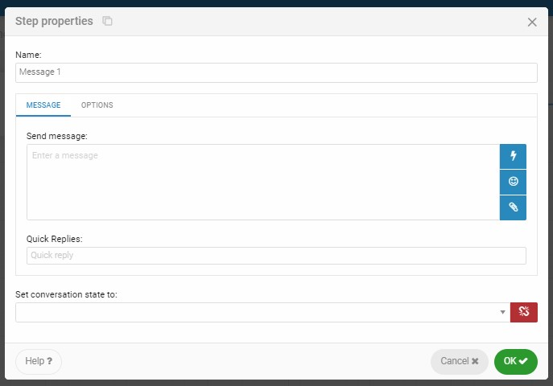
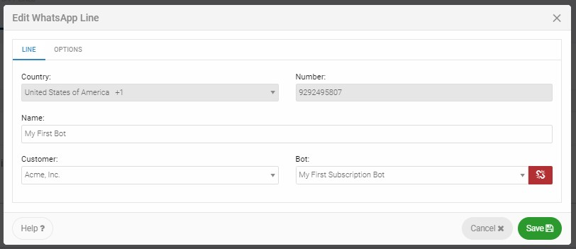

# User Guide

## **Technical concepts**

**WhatABot** is an automatic conversational response service that integrates chat apps and Bots**.** Our goal is to connect brands and consumers in a direct, friendly, and immediate way with a purpose.   WhatABot enables companies to automate business processes on WhatsApp, Facebook Messenger and webchat.    

### Bot Model

Our Bots are designed to return logical responses according to their purpose by following a set of set rules which are easily defined. These  rules are known as "Bot Models". Our Customers can build Bot models, step by step, in the Portal's Bot Designer page.  

### Bot State

The Bot must know the exact point in which a conversation is taking place in order to generate responses that are coherent to the active conversation. To do so, the Bot uses a status machine that evaluates and determines the context to respond in the correct fashion.

### Bot Variables

For the Bot to be more accurate and able to determine the context of the conversation, besides the status, a series of variables can be defined. Those variables are being enriched during the conversation. It is possible to define as many variables as needed depending on the rules and scope built into the Bot.

#### Conversation Variables

They are defined on the **chat** object by the user. There is no limit to the number of conversation variables that can be set. The scope of these variables is at the conversation level. If the conversation ends or times-out the values saved on them are lost.

#### Message variables

They are predefined on the **message** object and represent the message sent by the end-user to the Bot.  The scope of these variables lasts while the Bot sends the next response to the end-user.

Let's review each msg variable.

| variable | Description |
| :--- | :--- |
| `msg.body` | Contains the text of the message sent by the user. |
| `msg.type` | Contains the type of message sent by the user. Type of values are:  |
|  | `chat` for text message. |
|  | `image`for image or a picture files. |
|  | `document`for PDF, Word, Excel or PowerPoint files. |
|  | `location`for GPS location. |
|  | `audio`for audio files. |
|  | `video`for video files. |
|  | In the case that the message type sent is not chat, then the `msg.body` variable will provide the content of the multimedia element in Data Url format. |
| `msg.id` | This variable contains identifier of the end-user that sent the message.  For WhatsApp, the identifier is the country code + the phone number + @c.us. |
| `msg.profile` | This variable contains the name of the end-user if available. |
| `msg.email` | This variable contains the email address of the end-user.  Not available for WhatsApp. |
| `msg.line` | This variable contains the WhatsApp line identifier, or the Facebook page in which the Bot interacts with the end-user. |
| `msg.platform` | This variable contains the type of messaging platform used by the end-user. WhatsApp - Facebook Messenger - or- Webchat |

### Bot Designer

The Bot Designer is a user-friendly tool to easily draw simple flow diagrams that represent the bot logic. This diagram flow is know as the Bot Model that is composed of States, Steps and Connectors.

Each Bot Model starts with a State type step that is represented with a green circle. There are 6 types of steps that are linked with Connector lines. This collection of linked Steps end up always with a Message type Step or a Jump type Step.   For more information on Steps, please go to the "Types of Steps" section.  

### Designer Toolbar

The Bot Designer has a toolbar in the upper right side as shown below. 

### New State Button

Shown as a flag in the toolbar, this button adds a new State with a default State Step to the Model.  Unlimited States can be added.

### Options Button

Shown as a wrench, this button shows a list of entries with useful options grouped by Model and Bot.

#### **Validate**

This option checks the consistency of the Bot Model to make sure that all Steps are properly connected and end with a Message or Jump State. This option does not include logic validations, only structure.

#### **Select all**

This option selects all steps of the Bot Model to move them at once. To remove the selection, simply click on any empty part of the workspace. 

#### Show Text

This is a convenient option to see all texts within the Message steps in the bot Model without selecting each one. It saves time for reviewing all Bot possible responses to make adjustments.

#### Conversation Settings

The **OPTIONS** tab shows:

* **Chat variables:** where all chat variables define along the bot are visible.
* **Dialog timeout:** this value, expressed in Days, Hours, and Minutes, represents the time the conversation can remain active without any interaction. Once this period is completed, the bot goes inactive. This means that the conversation flow will start up again from the initial State in the next interaction and all variables will be reset. The default timeout is 20 minutes.

#### **Save as a copy**

This option is very useful to clone a Bot in production to make and test changes without any risk or simply to use it as a starting model for a new bot.

#### Export

The Bot Model can be exported to an external file with a .bot extension. This might be useful for backup purposes or to share the file with a different WhatABot account. 

#### Import

This options allows importing a .bot file to the system.

#### **Web chat**

Bots can be deployed over multiple channels. One of them is a website.  In order to publish the Bot to interact with website visitors, this option must be activated in the Web Chat option. 

Follow these steps to activate Web Chat:

* Click the "Activate Web Chat for this Bot" option
* Enter a welcome message for your Web Chat visitors in the Header Text field.
* Select the widget design options from "Rectangular" or "Round" icon and the color. 
* Copy the script to be inserted in the website html code before the &lt;/body tag closes. This deploys the Bot.

### Test Button

While building a Bot, this option can help test within the designer so you can easily make adjustments until the Bot behaves as expected. 

There are two testing options:

#### Test Bot

This option allows to test the bot on-screen. 

While testing your bot you also have access to values stored in chat variables and the current State where the conversation flow is taking place.  This information is available by clicking the blue lightning icon on the left of the window, and looks as shown below.

#### WhatsApp Test 

This option allows to test the bot on WhatsApp from a provided test line.  To test on WhatsApp you need to register the phone number from where you want to test by entering the country and cell phone number.

You can register multiple phone numbers to test from.  This registration is valid for 24 hours.  

To test the bot on WhatsApp, add the test line number as a contact on your phone.  In the image, the test line is +1 \(321\) 445-7299.  Finally, open WhatsApp and send a message to your bot.

## Types of Steps

### **State Step**

All conversation states start with a State type step and end with a Message type step or a Jump type step. The State Step is created by default when a new bot is created or a new State is added. There is no limit on the number of states in the Bot Model. This will depend on the Bot logic.

### **Condition Step** 

This step evaluates a Yes/No type condition to determine which path the conversation flow will follow.  

#### Condition Step Properties 

Click on the "Options" button in the Condition Step card to open the Step properties window and fill out the fields as described below.

**Name:** enter a descriptive name for the step condition.‌

**Condition:** set the logical condition to evaluate in the following fields:‌

* **First:** select the variable to evaluate \(`a`\).
* **Second:** select the logical operator from the following list of options:

| Operator | Kind | Description |
| :--- | :--- | :--- |
| **Equals to** | Text / Numeric | If the variable `a`is equal to the value `b`. |
| **Starts with** | Text | If the content of the variable `a`starts with or is equal to the value `b`. |
| **Does not start with** | Text | If the content of the variable `a`does not start with the value `b`. |
| **Contain** | Text | If anywhere in the content of the variable `a`is the value of `b`. |
| **Do not have** | Text | If the value of `b`is not contained in any part of the variable `a`. |
| **Empty** | Text | If the variable `a`has no content. |
| **Not empty** | Text | If the variable `a`contains at least one character. |
| **Greater than** | Text / Numeric | If the value of the variable `a`is greater than the value of `b`. |
| **Greater than or equal** | Text / Numeric | If the value of the variable `a`is greater than or equal to the value of `b`. |
| **Less than** | Text / Numeric | If the value of the variable `a`is less than the value of `b`. |
| **Less than or equal to** | Text / Numeric | If the value of the variable `a`is less than or equal to the value of `b`. |
| **Regex** | Text | If the value of the variable `a`complies with the regular expression given in `b`. |

* **Third:** enter a value or select a variable from the list \( `b`\) to complete the condition to evaluate.  The result value is set as:

  **Yes** : if condition is true. Shows the next step to execute.

  **No** : if condition is false. Shows the next step to execute.

### **Process Step**

Through this step, the Bot can connect to external systems such as an E.R.P. or a C.R.M. This way it can get or send information via webhooks.

#### Process Step Properties 

‌Click on the "Options" button in the Process Step card to open the Step properties window and fill out the fields as described below.

**Name** : enter a descriptive name for the process step.

**Webhook** : enter the Method, URL and necessary Variables for the webhook to operate correctly.

‌**Method:** you can choose GET or POST to make the request.‌

**Variables:** send and receive variables.‌

* **Webhook variables:** \(GET or POST\) define the variables that the Webhook will return from the URL.
* **POST variables:** \(Only POST\) select the variables you are sending to the webhook.

**Next step:** shows the next step to execute.

### **Expression Step**

Through this step, the Bot can make simple calculations using mathematical, numerical, text and/or date-time formulas.  The result of the operation can saved in a chat variable for later use. 

#### Expression Step Properties 

Click on the "Options" button in the Expression Step card to open the Step properties window and fill out the fields as described below.

**Name:** enter a descriptive name for the expression step.

**Conversation variable:** define the chat variable where the result will be saved.  Here you can select from a list of existing variables or enter the name of a new one.

**Expression value statement:** enter the expression you want to evaluate. 

Please abide by the following rules:

1. Literal values as text \(strings\) must be enclosed in quotes " "‌, for example: `"Good morning"`
2. Numeric values must be enter plain, for example: `12` 
3. Decimal values must be enter with a separating dot, for examples: `12.56`.‌
4. The expression can also include chat or msg variables. These variables can be selected from the blue lightning icon on the right.  
5. Arithmetic operators are allowed, for example:  `3 + 6`
6. The expression can include various functions.  This functions can be selected from the  **`</>`** icon on the right.  There are five types of functions: Numeric, Text, Date, Logic and Constants.
7. Finally, emoticons can also be included. 

**Next step:** shows the next step to execute. 

### AI Step \(Artificial Intelligence Step\)

Through the AI step, you can further the intelligence of your Bot by adding an extra level of thinking. 

By referencing an AI Module that has been previously tested and trained, the AI step can understand the user’s intention and provide a proper response.  The AI Module incorporates specific “Entities” to understand natural language “Phrases” entered by the user.

Artificial Intelligence is further discussed In the "Introduction to AI" section further down. 

#### AI Step Properties 

Click on the "Options" button in the AI Step card to open the Step properties window and fill out the fields as described below.

**Name:** enter a descriptive name for the AI step.

**AI Module:** select the Customer and the AI Module from the list.  The AI Module will evaluate the end-user message in natural language and will return a set of values as a result.

**Variables:** the set of values returned by the AI module will be saved in chat variables.  These chat variables will support a logic response to the end user. 

**Next step:** shows the next step to execute. **Trace Log Step**

Through this step, the bot can log of Conversation activity. This log is used to create Reports for statistics and business intelligence purposes.  

### **Message Step**  

This is the final step for every State \(except for the Jump step shown below\). Through this step, the Bot provides a logical response to the end-user. This step also sets the next State of the conversation where the next end-user message will be processed.

#### Message Step Properties

Click on the "Options" button in the Message Step card to open the Step properties window and fill out the fields as described below.

**Name:** enter a descriptive name for the Trace Log step. 

**Message:** compose the message you want to send to the end-user with text, variables, emoticons and multimedia content.

**Quick Replies:** if the message to the end-user requires a response, then you can ease the end-user interaction by providing Quick Replies, shown as buttons, that can be selectable. This option does not work for WhatsApp. If you want the button to have a label \(text\) different from its value, then separate the label value with a vertical bar \( \| \).  This way by creating the "Size S \| a" quick reply, the button will be seen as "Size S", but the returned value will be "a". 

**Options Tab:** defines how to treat next end-user's response. 

**Save user response in:** define or select a chat variable where the response will save. 

**Download user response media content:** if we expect the user to send a media content \(audio, image, video, or document\), then the Data URI can be stored in the defined variable. 

**Obfuscate user response:** this option will mask user response when saved to WhatABot's database. Please notice that obfuscating an end-user response will prevent WhatABot from acceding this information in the Conversation option and Reports. 

**Set conversation state to:** this field defines the Bot State where the next end-user message will be processed.  This is how a Conversation evolves. 

### **Jump State**

This step sends the conversation flow to another bot. Along with the Message step, the Jump step is the other final step for a State. 

#### Jump Step Properties

This step sends the conversation flow to another bot. Along with the Message step, the Jump step is the other final step for a State. 

Click on the "Options" button in the Jump Step card to open the Step properties window and fill out the fields as described below.

**Name:** enter a descriptive name for the Jump step.

**Go to bot:** select the customer and the bot where you want the conversation flow to continue. A mark on the step will indicate which bot will continue the conversation. The conversation variables will persist in the selected bot.

## "How to" Section

### How to Create Your First Bot

This video shows all the steps you need to learn to get ready to create your first bot in 6 minutes.



### How to Integrate a Bot with Core Business Systems

For the Bot to connect with external systems, it is necessary from within a Process type Step to specify a Webhook URL that must meet the following specifications: 

1. The webservice must be RESTful type with JSON format. The allowed methods are GET and POST. 
2. The service must respond with a chat type object that includes the variables defined in the Bot and the Process type Step.
3. All Bot variables are text type. 
4. If the used method is POST, selected chat and message variables are sent.



### **How to Add Artificial Intelligence \(AI\) to a Bot**                                                                               

Through the AI type step, you can further the intelligence of your Bot by adding an extra level of thinking. 

#### About the AI Module

By referencing an AI Module that has been previously tested and trained, the AI step can understand the user’s "Intent" in natural language and provide a proper response. The AI Module incorporates specific “Entities” to understand natural language “Phrases” entered by the user.

#### Steps to Create and Train an AI Module

Creating an AI Module involves 4 easy steps as explained below:

#### **First Step: Create Intents** 

An Intent is an action or activity that and end-user states in a natural language message. The goal of the AI module is to understand this Intent so the Bot provides an appropriate response to the end-user and according to the Bot's purpose.

#### **Second Step: Add Phrases**

By adding sample Phrases for each created Intent the AI engine starts learning how humans communicate in terms of words, syntax, and structure. In order to have a good level of training, it is recommended to add at least 10 sample Phrases per Intent.

#### **Third Step: Create Entities**

An Entity is a value extracted from Phrases. For instance, if the Intent is to buy an air ticket, then Entities for this Intent might be Date, the City of Origin, and the City of Destination. Once Entities are created per Intent, then go back to the sample Phrases, and per each of them teach the Module what words belong to each Entity..

#### **Fourth Step: Save and Train**

Once you have created user Intents, added sample Phrases per Intent, and define Entities per Intent, it is time to Save and Train. This way a new trained version of the AI Module is created. 

Each version is named by the date and time it was created. Up to 3 trained versions per AI Module can be saved. In case more versions are required, just delete a previous one. 

Once saved and trained, it is time to test the AI Module. Click on Test under Actions at the version level or on the Test tab. Here you can enter natural language phrases to get a result table that shows: intent name, intent probability, and extracted entities. If results are not as expected, more phrases and training is required.


To make an AI Module version available to a Bot Model, it needs to be pinned. Just click on the Pin action at the version level. 

An AI Module can be used in different Bot Models. This way you can build it once and use it many times.


Please watch the following video to learn how to create your first AI Module.



### How to Deploy Your Bot

To deploy your Bots, click on the Channels option on the left pane menu. Here you will see all the available channels.

#### Deploy on WhatsApp 


In order to add lines to your subscription, please go to your Subscription page and change your plan.  


Once you have available lines, click on WhatsApp to see a list of lines with detailed information.

In order to deploy your Bot on WhatsApp, just click on the Edit action.  The below window is shown.

Under the LINE tab, please name your line on the Name field, select the Customer and Bot to deploy.

Click the OPTIONS tab to enter business information that will be visible to end-users on WhatsApp.


Business information will be visible to users in up to 48 hours after entered or modified. 


#### Deploy on Facebook Messenger 

Click on Messenger to see all subscribed Facebook Pages. Prior to deploying a Bot on Facebook Messenger, you need to have a Page that needs to be subscribed to WhatABot.

To subscribe a new page, click on the Subscribe Facebook Page button.  The below window is shown.

To see all available pages in your Facebook account, click on the "Get Facebook pages" button. From this point, please follow on-screen steps to access Facebook, select the desired page, and provide permissions to WhatABot.

Once you get the page, select the Customer and Bot to be assigned. Finally activate it to make it available to end-users on Messenger.

#### Deploy on Your Website

The third channel to deploy your bots is on your own website \(or your customer's\).    Click on Web Chat to see all available web chats in your account.


Web Chats shown under this option where previously set on the Web Chat option in the Designer toolbar.  Please [click here](user-guide.md#web-chat) for detailed instructions.


Select a web chat entry to customized some parameters and get the script to insert on your website in the Body section.

## Broadcast


This option is not available due to current WhatsApp and Facebook Messenger restrictions to prevent spam. 


## **Reports**

There are 3 types of WhatABot reports.  

### Trace Log

A Trace Log report extracts information recorded by a Trace Log Step.  Please watch the following video to learn more.



### Indicators

This option shows Bot's KPIs in a period of time. To generate the report, the following information is required.

The Universe field refers to the potential number of end-users a specific Bot might reach.   This number is needed to make KPI calculations.

#### Penetration

Shows the % of end-users from the Universe that have interacted with the bot on a monthly basis.  It helps understand the potential end-users to reach.

#### Retention

Shows the percentage of users that had a conversation in a month that interacted as well in the previous month. This metric lets us know how likely a single end-user will use the Bot service again. 

#### Active Users

Shows the number of unique Active users that interacted with the Bot on a monthly basis. 

### Account Active Users

Shows the list of the Active Users in your WhatABot account.

## Resources 

### Users

This option allows to manage Portal Users available on your subscription plan.  


In order to add users to your subscription, please go to your Subscription page and change your plan.


### Customers

This option allows to manage Customers.  


Starter and Advanced subscriptions are limited to a single customer.  If you need to serve multiple customers, please upgrade to our Professional subscription.


## Submit a ticket

If you need help, please don't hesitate to contact us by submitting a ticket through the Portal.  This option is available under the Help option in the left menu pane.

 This window allows users to select the type of help required.  There are 5 types to select from the list:

* Feature Request
* Tech Support
* Account Support
* Report a Bug
* Other

A file of up to 10 MB size can be attached.  We are here to help.

