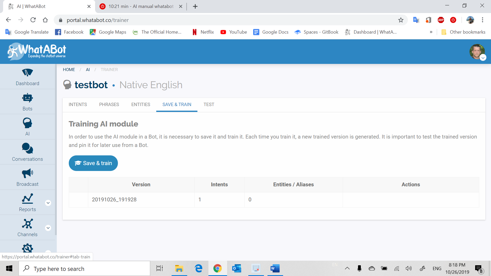
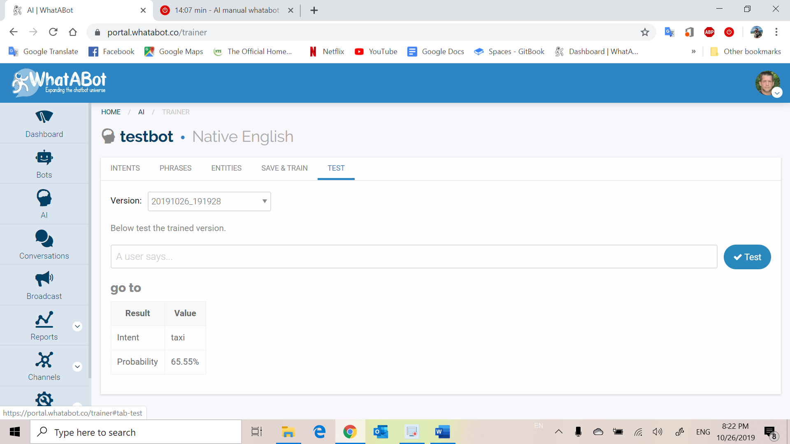

# AI

**Introduction to AI**

When it comes to complex tasks, the AI bots rely on an action sequence to establish the primary goal of the user with the help of memory of the past user responses and the mapping of requests from users to valid responses stored in the response repository. These intelligent bots may either map responses based on similar  history information of  different user, or the same, and create intelligent responses based on the keywords in the users request.

Simply put, a chatbot’s receives input data, interprets it, and translates it into a relevant output value. Upon receiving the input data, it must analyze and contextualize to determine the appropriate “reaction” to whatever prompt it has received.

Buy incorporating specific logic to understand specific Entities within phrases entered by the user. An example could be that entered phrase is as follows,- “I would like to book a flight to California” The AI set to understand “flight” and or "California", "Cal? the Entities. = The user is looking to travel and links you to your clients travel website with California set as destination.

Another, example could be, User- “I am hungry” = AI- “What do you want to eat”, User responds with “Pizza”= linking you to a pizza shop, Or “Chinese” = linking you with a list of local Chinese restaurants. Also, time, directions can be transferred with AI calling an Uber service to pick you up at point A and leave you at point B at 4:30pm. The AI will be able to understand the time and directions, to pass through the system for the service provider to get your Uber there on time.

This gives you the ability to fine tune specific data points to understand more difficult operations. Using different variables to guide the system in a direction dependent on said variables and it will learn. 

So lets go ahead and click on the AI button on the left hand side

Now click on the Intents tab

\(add vid\)

**Intents**

Define intents – An Intent is an action or activity that a bot can understand from what a user says Therefore, it is important to provide enough samples of phrases that specifically represents the intent. With this information it is possible to train the bot so that it understands the user. The more phrases you use \(up to 100\) The more parameters THE Bot will have to act out the desired needs. Click on intent tab and a window will appear with the necessary fields to be completed accordingly for your model.

Intent video-

**Phrases**

Here you will provide sample phrases to represent the intent\(s\) purpose. Also you can select possible entities to extract in each of them. Click on the Phrases tab to open option window containing necessary field entries for recognition.

Phrases video-

**Entities**

An entity is a value extracted from phrases that a user says. You can define its different values with their possible synonyms for each entity, or by using regular expressions. Click on Entities tab to open option window to complete necessary fields before training AI model.

Entities video-

**Save and Train**

Here you can save your AI model and follow the steps to train. Click on the tab Save and Train , here train your model to make sure its responding accordingly or if you have to change or add more information to correct its response.

**Test**

Here you can test the functionality of the AI model. Click on the Test tab and choose which bot you want to test from the version field then enter information to test bot and click on test. You will notice a result will appear and value.

Test video-

