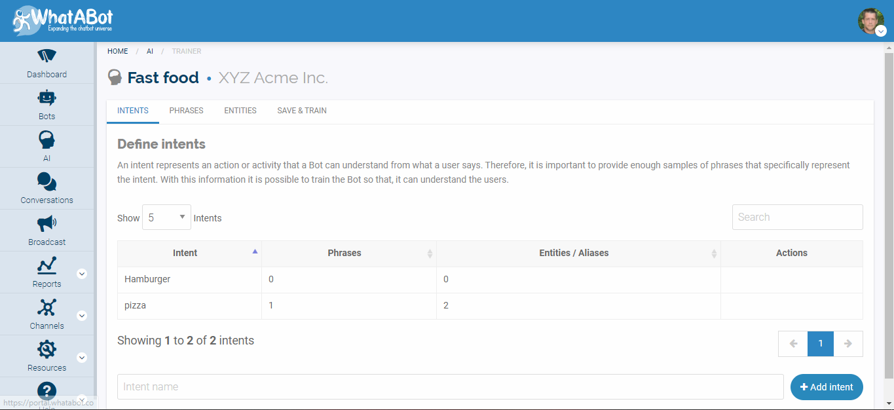
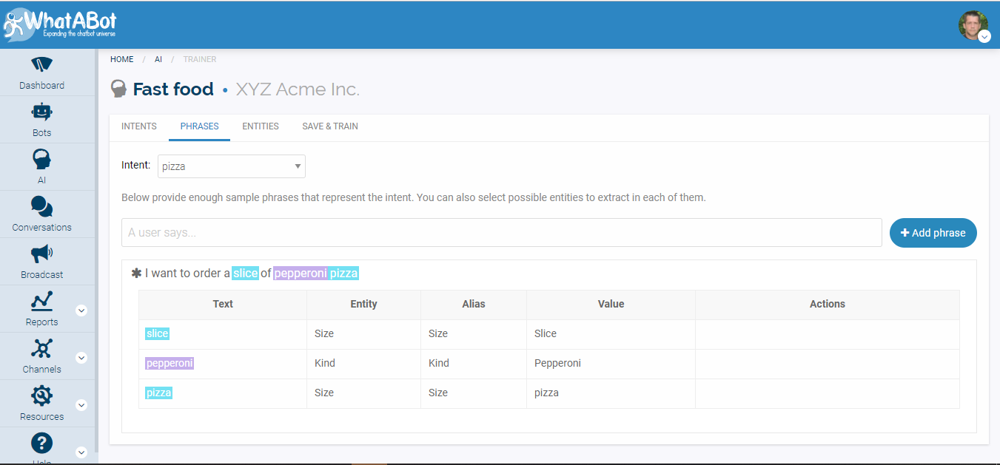
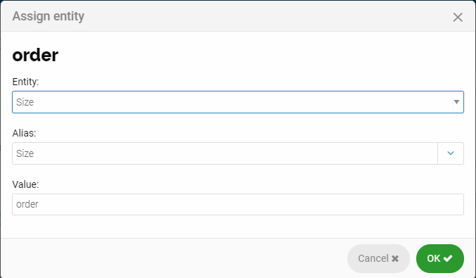
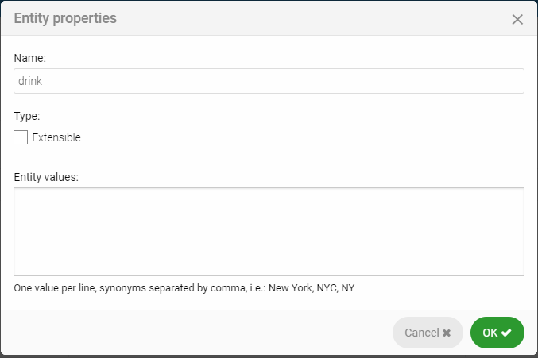
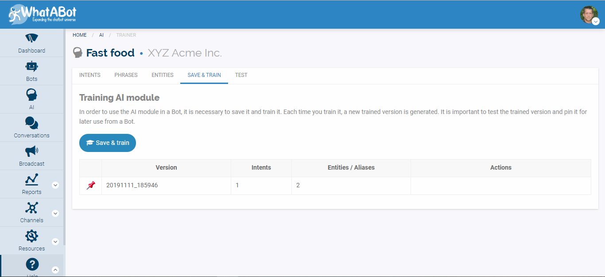
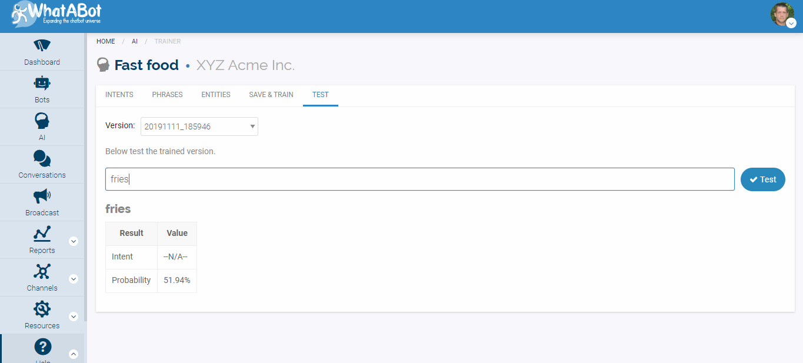

# AI

**Introduction to AI**

Put simply, a Chatbot’s AI receives input as an Entity, it interprets the Entity, and translates it into an Intent output value. Upon receiving the appropriate Entity entities, it must analyze and contextualize to determine from the Phrase the user entered for the correct Intent response to the correct Intent prompt it has received.

By incorporating specific “Entities” to understand from “Phrases” entered by the user and creating an “Intent” list. The AI can understand the user’s intention and provide the proper outcome.

This gives you the ability to fine tune the AI to recognize specific Entity points to understand more difficult Intents. Using different variables to guide the system to understand the intent from the entities it finds in the given set of phrases.

**Intents** 

 An Intent is an action or activity that a Bot can understand from what a user says in a Phrase. Therefore, it is important to provide enough samples of Phrases that specifically represent the Intent. With this information it is possible to train the Bot so that it understands the user’s intention. The more phrases you use \(up to 100\) The more Entities the AI in the Bot will have to act out the desired Intent. Click on Intent tab and a window will appear with the necessary fields to be completed accordingly for your AI.

Click the add Intent button, you can now enter your intention. The more parameters you need the more Intents you will need. Hovering the mouse over the  option field of the Intent you can see "Phrases" or "delete". Clicking on Phrases will open the Intent in the Phrases window to enter Sentences containing entities.

Intent video-pic

**Phrases**

Here you will provide sample phrases to represent the intent\(s\) purpose. Also, you can select possible entities to extract in each of them. Click on the Phrases tab to open option window. In the Intent field you can choose a given Intent to link with the phrases you are about to enter.  Click on the add Phrase button to add as many phrases you need according to your models’ job. Phrases containing Entities or new words in Phrases can be highlighted to represent the intent. Pick the new word and double click it. A window will appear to fill in the values and Entity and alias the new word will relate to.

Assign Entity by double clicking on the word in the phrase. The following window will appear. \(for this I double clicked on **order** from the phrase in the above photo\)

Click on entity and add the entity you wish to connect with the word.

Click on alias and assign accordingly. 

Lastly assign the value.

**Entities**

An entity is a value extracted from phrases that a user says. You can define its different values with their possible synonyms for each entity, or by using regular expressions. \(1\) Click on Entities tab to open option window to complete necessary fields before training AI model.

\(2\) Click on the add Entities field, enter the Entity then click the add Entity button in the bottom right corner. Your entity will appear on the list with the option to edit. Click on edit to name, and choose type, and entity values.

Entities video-pic

**Save and Train**

 Click on the  Save and Train tab, here train your model to make sure that it is responding accordingly to the given sequence of Intents, Entities, and Phrases or if you have to change or add more of the above values to correct its response.

When you hover the mouse over the given version the option along the right-hand side will appear to Pin, Test, or Delete. Click on test. This will take you directly to the Test window.

**Test**

Here you can enter phrases that contain the set parameters between Intents, and Entities. Enter the test Phrase and click the test button. Below your entry the result and value will appear showing your percentage and values.

\*\*\*\*

